<!--
  Jhon Zuluaga — Full Stack Developer
  Contact: jhonzuluagaj@gmail.com | GitHub: @JhonZuluaga-J
-->

<div align="center">

<!-- EPIC BOSS BATTLE - PIXEL ART STYLE -->



⚔️ 8-bit style battle: Dodge → Teleport → Counter-Attack → VICTORY! ⚔️

<br/>


[](https://git.io/typing-svg)

</div>

---

## What I Bring

```
Code Quality:      ████████████████████████████████████  High Standards
Problem Solving:   █████████████████████████████████░░░  Analytical Thinker
Continuous Learning ████████████████████████████████░░  Self-Driven
Collaboration:     ███████████████████████████████████░  Team Player
Attention to Detail ██████████████████████████████████░░  Precision-Focused
```

I build clean, maintainable applications with a focus on **user experience** and **code quality**. My approach is **learn-by-building**: every project is an opportunity to master new technologies and solve real problems.

---

## Technical Skills

| Area | Technologies | Level |
|------|-------------|-------|
| **Frontend** | Next.js, React, TypeScript, TailwindCSS | Production-ready projects |
| **Backend** | Node.js, Express, PostgreSQL, Redis | Multiple deployed applications |
| **DevOps** | Docker, AWS basics, CI/CD with GitHub Actions | Hands-on experience |
| **Testing** | Jest, Playwright, Vitest | TDD practitioner |
| **Tools** | Git, Linux, VS Code, Figma | Daily workflow |

---

## Skill Proficiency

### Languages
```
TypeScript       ████████████████████████████████░░░░  Most Used
JavaScript       ████████████████████████████████░░░░  Strong Foundation
SQL              ██████████████████████████████░░░░░░  Query Writing
Python           ████████████████████████░░░░░░░░░░░░  Learning
```

### Frontend
```
Next.js          ████████████████████████████████░░░░  Primary Framework
React            ████████████████████████████████░░░░  Component Design
TypeScript       ████████████████████████████████░░░░  Type Safety
TailwindCSS      ████████████████████████████░░░░░░░░  Styling
Testing          ██████████████████████████░░░░░░░░░░  Growing
```

### Backend & Tools
```
Node.js          ████████████████████████████████░░░░  API Development
PostgreSQL       ████████████████████████████░░░░░░░░  Database Design
Redis            ██████████████████████████░░░░░░░░░░  Caching
Docker           ████████████████████████░░░░░░░░░░░░  Containerization
Git              ████████████████████████████████░░░░  Version Control
```

---

## Focus Areas

| Practice | Description |
|----------|-------------|
| **Design-First** | Planning architecture before implementation |
| **Test-Driven** | Automated tests as core development practice |
| **Documentation** | Clear READMEs and inline documentation |
| **Continuous Learning** | Regular exploration of new technologies |

---

## What I'm Building

Exploring **full-stack development** through hands-on practice:

- **System Architecture** — Database design, API patterns, microservices
- **DevOps & Deployment** — Docker, CI/CD, cloud infrastructure
- **Performance** — Caching strategies, query optimization, load testing

*Check my repositories for current work and experiments.*

---

## GitHub Activity

<div align="center">


<br/>


</div>

---

## Technology Stack

<div align="center">


</div>

---

## Currently Learning

```
┌─────────────────────────────────────────────────────────────────────────┐
│                                                                         │
│  🎯 Advanced System Design — Distributed systems patterns               │
│  🎯 Cloud Architecture — AWS certification path                         │
│  🎯 Performance Optimization — Caching, indexing, load balancing      │
│                                                                         │
└─────────────────────────────────────────────────────────────────────────┘
```

---

## Connect

<div align="center">

[](mailto:jhonzuluagaj@gmail.com)
[](https://github.com/JhonZuluaga-J)
[](https://linkedin.com/in/jhonzuluaga)

<br/>

[](https://github.com/JhonZuluaga-J)

</div>

<br/>

